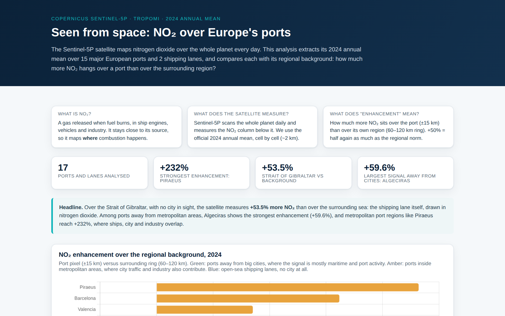
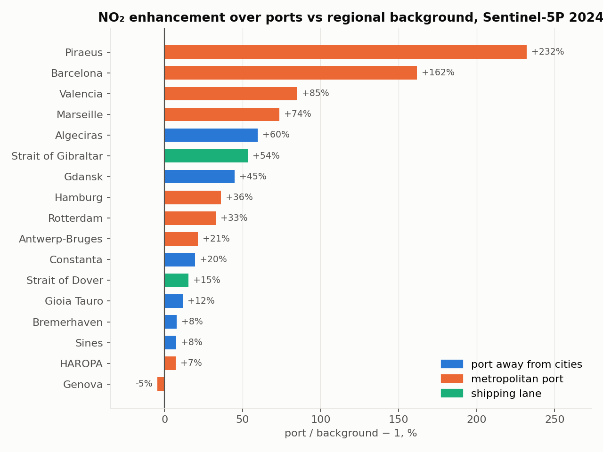
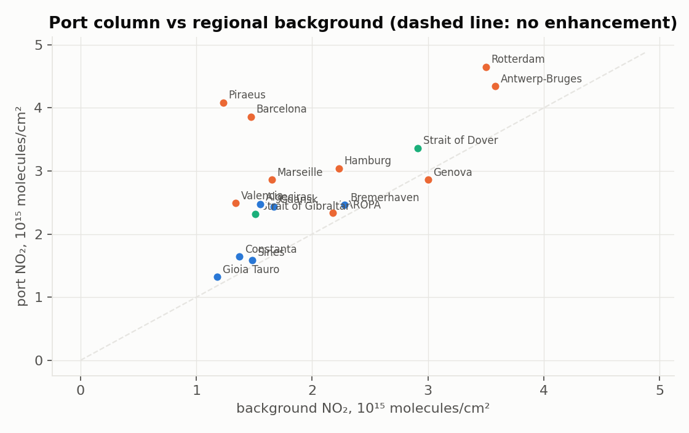

# Seen From Space: NO₂ over Europe's Ports

**Tropospheric NO₂ over 15 major European ports and 2 shipping lanes, from the Copernicus Sentinel-5P (TROPOMI) 2024 annual mean, compared with each port's regional background**

[](https://eu-ports-no2.vercel.app/)
[](LICENSE)
[](https://data-portal.s5p-pal.com/)

<p align="center">
  
</p>

## What this is

The Sentinel-5P satellite maps nitrogen dioxide over the whole planet every day. This project takes the official 2024 annual-mean grid produced by the ESA S5P-PAL service, extracts the NO₂ column over each port (±0.15°, about 15 km) and over a ring around it (0.6° to 1.2°, about 60 to 120 km), and reports the **enhancement**: how much more NO₂ hangs over the port than over its own region.

| Finding (2024 annual mean) | Value |
|---|---|
| Strait of Gibraltar (open sea, no city) | **+53.5%** NO₂ vs background: the shipping lane, visible from orbit |
| Strongest port away from cities | Algeciras: **+59.6%** |
| Strongest metropolitan port region | Piraeus/Athens: +232% (ships, city and industry together) |
| Cleanest maritime signals | Algeciras, Gdansk, Constanta, Gioia Tauro, Bremerhaven, Sines |

Targets are grouped into three settings so that the reader does not over-attribute: **away from cities** (signal mostly maritime and port), **metropolitan** (city traffic and industry contribute) and **shipping lanes** (no city at all).

## Gallery

| Enhancement by port and setting | Port column vs background |
|---|---|
|  |  |

## Reproducing

1. Download the yearly L3 tropospheric NO₂ grid from the [S5P-PAL data portal](https://data-portal.s5p-pal.com/) (STAC API, product `s5p-l3grd-no2-tropospheric-001-year-*`, about 1.4 GB, no registration).
2. Extract the port and background values:

```bash
pip install netCDF4 numpy
python3 extract_v2.py          # edit the file path at the top first; writes data.json
python3 -m http.server         # preview at http://localhost:8000
```

3. Deploy to Vercel (framework: Other) or GitHub Pages. The page fetches `data.json`, so it must be served over HTTP.

## Repository map

| Path | Content |
|---|---|
| `index.html` | The site: chart, full table and method |
| `data.json` | Extracted values consumed by the page |
| `extract_v2.py` | Extraction script (netCDF4 + numpy) |
| `process_no2.py` | First version of the extraction, kept for reference |
| `docs/gallery/` | Figures used in this README |

## Method and caveats

- Grid: 8192 × 16384 global (about 0.022°), 2024 annual mean, tropospheric NO₂ column. Units converted from µmol/m² to 10¹⁵ molecules/cm².
- Port value = mean in a ±0.15° box; background = mean in a 0.6° to 1.2° ring; enhancement = port/background − 1.
- NO₂ has many sources; metropolitan enhancements must not be read as ship-only. Negative values occur when the region around a port is more polluted than the port itself (Genova against the industrial Po basin).
- NO₂ is a co-emitted combustion tracer, not CO₂: it serves as an independent, space-based check on activity-based emission estimates such as those in the companion projects.

## Related projects

- [shipping-methane-monitor](https://github.com/darlianecunha/shipping-methane-monitor) and [shipping-carbon-costs](https://github.com/darlianecunha/shipping-carbon-costs): reported emissions from the EU MRV, the bottom-up counterpart to this top-down view
- [maritimeco2](https://github.com/darlianecunha/maritimeco2): activity-based at-berth CO₂ estimation

## How to cite

Metadata in [`CITATION.cff`](CITATION.cff).

> Cunha, D. R. (2026). *Seen from space: NO₂ over Europe's ports, Sentinel-5P 2024* [Software and dataset]. GitHub. https://github.com/darlianecunha/eu-ports-no2

## Author and licence

**Darliane Ribeiro Cunha, PhD**. Research: maritime decarbonisation, port sustainability analytics, SDG implementation. [ribeirocunha.com](https://ribeirocunha.com) · [ORCID 0000-0003-2548-1237](https://orcid.org/0000-0003-2548-1237)

Contains modified Copernicus Sentinel data (2024), processed by S5P-PAL. Analysis, figures and site: [CC BY 4.0](LICENSE).
